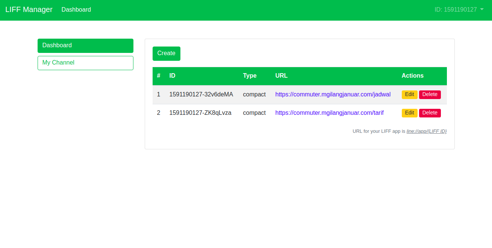

# LIFF Manager

[LIFF (LINE Front-end Framework)](https://developers.line.me/en/docs/liff/overview) Manager is an unofficial tool for manage your LIFF apps. This application made by [M Gilang Januar](https://www.line-community.me/contributors/detail?apiId=0037F00000ZnJvgQAF) (a LINE API Expert from Indonesia). Due to this project is open source with MIT license, you can contribute by fork this repository and make a pull request. We don't use any database or storage, all your credentials are stored on cookies so it's safe and can't be taken by anyone.

## Requirements

 - Node.js >= v8.0

## Getting Started

 - Clone this repository
 - Install all depedencies with run `npm install`
 - Run `npm start` on production or `npm run serve` on development phase
 - Or just visit [https://liff-manager.mgilangjanuar.com]()

## How to Contribute

 - Create an issue
 - Fork this repository to your GitHub account
 - Make changes
 - Create pull request to this repository

## License

[MIT](./LICENSE.md)

